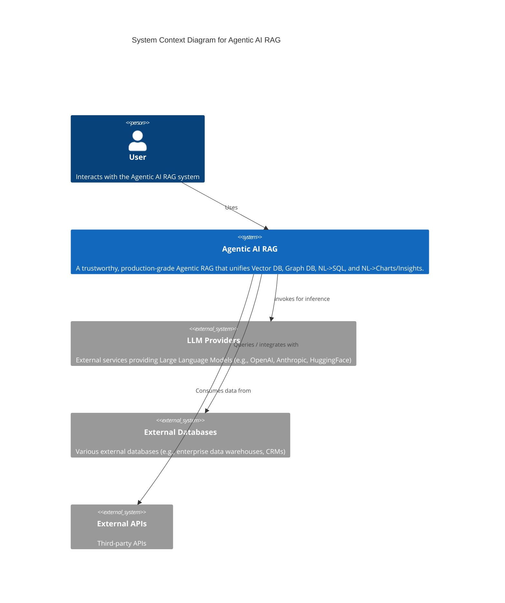

# Agentic AI RAG (Open‑Source) – Architecture & System Diagram

**Goal:** A trustworthy, production‑grade Agentic RAG that unifies

1. Vector DB embeddings,
2. Graph DB embeddings,
3. Natural Language → SQL, and
4. Natural Language → Charts/Insights — (MCP and Docling.

---

## High‑Level System Diagrams

## C4 Model Diagrams

This section will contain C4 model diagrams (Context, Container, Component, Code) to provide a more detailed architectural view.

### Context Diagram

### Container Diagram

```mermaid
C4Container
    title Container Diagram for Agentic AI RAG
    
    Person(user, "User", "Interacts with the Agentic AI RAG system")

    System_Ext(llm_providers, "LLM Providers", "External services providing Large Language Models")

    System_Boundary(agentic_rag_system, "Agentic AI RAG") {
        Container(web_ui, "Web UI", "React/Next.js", "Provides the user interface for interaction")
        Container(api_gateway, "API Gateway", "FastAPI", "Exposes RESTful APIs for the Web UI and other clients")
        Container(agent_orchestrator, "Agent Orchestrator", "Python, LangGraph", "Manages the agentic loop, tool selection, and execution")
        Container(vector_db, "Vector Database", "Qdrant/Milvus/Weaviate", "Stores and retrieves vector embeddings for RAG")
        Container(graph_db, "Graph Database", "JanusGraph/Neo4j/ArangoDB", "Stores and queries knowledge graph data")
        Container(sql_db, "SQL Database", "PostgreSQL/DuckDB", "Stores structured data and metadata")
        Container(object_store, "Object Store", "MinIO", "Stores raw documents, parsed content, and model artifacts")
        Container(cache, "Cache", "Redis", "Provides fast access to frequently used data and conversation memory")
        Container(etl_parser, "ETL/Parser Service", "Python, Docling/Apache Tika", "Processes and extracts information from various document formats")
        Container(ocr_service, "OCR Service", "Python, Tesseract", "Performs Optical Character Recognition on image-based documents")
        Container(chart_generator, "Chart Generator", "Python, Vega-Lite/Plotly", "Generates data visualizations and insights")
        Container(mcp_servers, "MCP Servers", "Python", "Provides controlled access to external systems (filesystem, Postgres, HTTP, shell)")
        Container(observability, "Observability Stack", "Prometheus, Grafana, OpenSearch", "Monitors system health, logs, and metrics")
    }

    Rel(user, web_ui, "Uses")
    Rel(web_ui, api_gateway, "Makes API calls to")
    Rel(api_gateway, agent_orchestrator, "Invokes")
    
    Rel(agent_orchestrator, vector_db, "Queries")
    Rel(agent_orchestrator, graph_db, "Queries")
    Rel(agent_orchestrator, sql_db, "Queries")
    Rel(agent_orchestrator, object_store, "Stores/Retrieves from")
    Rel(agent_orchestrator, cache, "Accesses")
    Rel(agent_orchestrator, etl_parser, "Invokes")
    Rel(agent_orchestrator, ocr_service, "Invokes")
    Rel(agent_orchestrator, chart_generator, "Invokes")
    Rel(agent_orchestrator, mcp_servers, "Communicates with")
    Rel(agent_orchestrator, llm_providers, "Invokes for inference")
    
    Rel(etl_parser, object_store, "Stores parsed content in")
    Rel(ocr_service, object_store, "Stores OCR results in")
    Rel(chart_generator, object_store, "Stores charts in")
    
    Rel(mcp_servers, sql_db, "Queries")
    Rel(mcp_servers, object_store, "Accesses")
   
```

## 1) Core Open‑Source Stack

* **LLMs (served via vLLM or TGI)** : Llama 3.1, Mistral 7B/8x7B, Qwen2.5
* **Embeddings** : BGE (FlagEmbedding), E5, Jina embeddings;  **Reranker** : bge‑reranker‑v2.
* **Vector DB** : **Qdrant** (simple ops) or **Milvus** (scale) or **Weaviate** (rich filters).
* **Graph DB** : **JanusGraph (Apache 2.0)** on Cassandra/Scylla/Elastic; or  **Neo4j Community (GPLv3)** ; or  **ArangoDB Community (Apache 2.0)** .
* **SQL Engine** : **PostgreSQL** (primary) + optional **DuckDB** for local/adhoc analytics.
* **ETL/Parsing** : **Docling** (PDF/Office to structured),  **Apache Tika** ,  **trafilatura** ,  **pdfminer.six** ,  **Tesseract OCR** .
* **Agent Orchestration** : **LangGraph** (deterministic agent graphs) for overall flow, integrating **LlamaIndex Workflows** (e.g., `RouterOutputAgentWorkflow` for dynamic tool selection between RAG and SQL).
* **MCP (Model Context Protocol)** : Open‑source MCP servers for  **filesystem** ,  **Postgres** ,  **HTTP** ,  **shell** ; MCP client embedded in the agent runtime.
* **Charts/Insights** : **Vega‑Lite** (spec‑driven),  **Plotly** , or **ECharts** (web).
* **API** :  **FastAPI** ; **Auth** via Keycloak/Ory; **Rate‑limit** via Traefik/Envoy.
* **Caching** : **Redis** (prompt/context cache).
* **Storage** : **MinIO** (object store for docs, parquet, model shards).
* **Messaging** : **Kafka** or **RabbitMQ** for async pipelines.
* **Safety/Guardrails** : **Cleanlab Codex** (for automatic response validation and trust scoring), **NeMo Guardrails** or  **Llama Guard** , plus allow‑lists/deny‑lists.
* **Eval & QA** :  **RAGAS** ,  **DeepEval** ,  **LangSmith‑OSS alt** .
* **Observability** :  **OpenTelemetry** ,  **Prometheus** ,  **Grafana** , **OpenSearch/Kibana** for logs.
* **Deployment** : Docker/Compose

---

## Architecture Overview

The system is designed with a modular and extensible architecture, incorporating advanced components for data ingestion, query processing, and reasoning.

### 2) Data Ingestion & Indexing Pipelines (Docling-first)

*   **Sources**: PDFs, Office docs, HTML, emails, S3/MinIO buckets, Git repos.
*   **Acquire**: Watcher (Kafka connectors or lightweight cron) pulls new docs to MinIO.
*   **Parse**: **Docling** as primary converter (layout, tables, figures) → normalized JSON/Markdown.
*   **OCR**: **Tesseract** for scanned PDFs; image segmentation via **layoutparser** (optional).
*   **Chunking**: structure-aware (headings, tables). Adaptive chunk size by token length (e.g., 512-1024 tokens).
*   **Embed**: BGE/E5; store **vector** in Qdrant with rich metadata; persist original text blobs in MinIO/Postgres.
*   **Graph Build**: NER & triplet extraction (spaCy/REL/REBEL) → entities + relations inserted into JanusGraph/Neo4j.
*   **Quality/Eval**: RAGAS on sampled docs; store metrics; alerts via Grafana.
*   **Reindex Triggers**: doc updates, schema changes, model upgrades (versioned embeddings), or KG enrichment jobs.

### 3) Query & Reasoning Flow (Agentic Loop)

**User → “Ask”** (UI) → **FastAPI** → **LangGraph** orchestrates the agentic loop, which may invoke **LlamaIndex Workflows** (e.g., `RouterOutputAgentWorkflow`) to dynamically decide and execute tools:

*   **Tool Selection & Execution**: The LangGraph agent, potentially via a LlamaIndex `RouterOutputAgentWorkflow`, intelligently selects between specialized tools based on the user's query.
*   **Semantic Retrieval (Vector)**: Query → dense retrieval (Qdrant/Milvus) → rerank top-k → ground LLM. Responses are enhanced with **Cleanlab Codex** for validation and trust scoring.
*   **Relational Reasoning (Graph)**: Entity linking → Cypher/Gremlin query → multi-hop path retrieval → summaries.
*   **Structured Access (SQL)**: NL→SQL using **LlamaIndex's `NLSQLTableQueryEngine`** (schema-aware) with models like SQLCoder/DIN-SQL → execute on Postgres/DuckDB → resultframes.
*   **Synthesis**: Fuse vector passages + KG facts + SQL tables → response plan.
*   **Charts/Insights**: Generate a **Vega-Lite spec** (bar/line/scatter) + textual insights (trends, anomalies, YoY/DoD deltas).
*   **Safety**: Guard the prompt and output using **Cleanlab Codex** (for response validation), NeMo/Llama Guard, plus policy checks + source attributions.
*   **Memory**: Short-term conversation in Redis; long-term artifacts in Postgres/MinIO.

### 4) MCP Integration

*   **Client**: Embed an MCP client inside the agent runtime (LangGraph node).
*   **Servers (examples)**:
    *   **mcp-filesystem**: safe, sandboxed FS access (read curated corpora from MinIO mounts).
    *   **mcp-postgres**: parameterized SQL with schema introspection for NL→SQL.
    *   **mcp-http**: controlled web fetch (with allow-listed domains) for augmentation.
    *   **mcp-shell**: limited commands for ETL jobs (doc ingestion, reindex).
*   **Policy**: Access control (RBAC via Keycloak); per-tool quotas; audit logs via OpenTelemetry.

### 5) Natural Language → SQL

*   **Models**: **SQLCoder-7B/34B**, **DIN-SQL-Llama-3**; optionally fine-tune on your schemas & query logs. The **LlamaIndex `NLSQLTableQueryEngine`** provides a robust framework for this.
*   **Schema Grounding**: Auto-describe tables/columns; maintain a **catalog** (data dictionary) exposed to the model via context.
*   **Execution Safety**: Read-only roles; SQL sandbox; dry-run with EXPLAIN; auto-LIMIT; reject DDL/DML unless explicitly allowed.
*   **Post-processing**: Convert resultsets to dataframes; feed to chart generator.

### 6) Natural Language → Charts/Insights

*   **Spec Generation**: LLM produces **Vega-Lite** JSON from a validated dataframe schema.
*   **Insight Templates**: trend, seasonality, outlier, contribution, pareto, cohort, funnel.
*   **Validation**: Schema/type checks; safe-list encodings; preview before render.
*   **Export**: PNG/SVG/PDF via Headless Chromium in a worker; store in MinIO.

### 7) Retrieval Strategies (that work in practice)

*   **Hybrid**: Dense (vectors) + sparse (BM25) + **rerank** (bge-reranker).
*   **KG-augmented**: Use graph to expand/bridge multi-hop questions; attach KG facts in context window.
*   **Citations**: Passages are always cited with doc_id + page/section.

